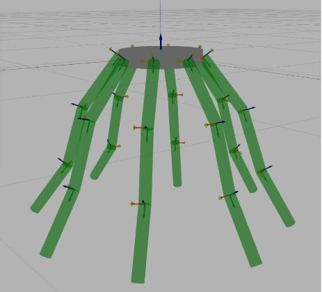
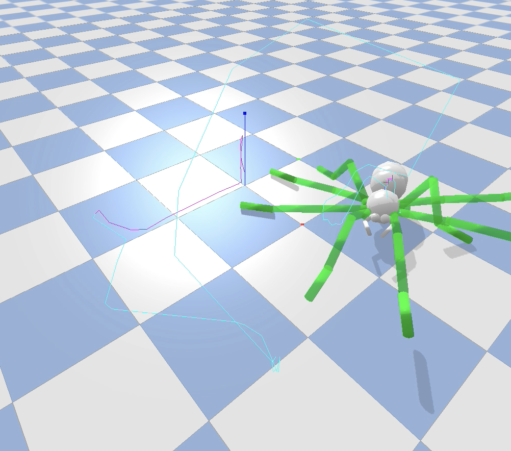

# Spider Robot Model

**Introduction**  
In this project, we executed trajectory optimization of a spider robot model using factor graphs.  

   

**Building a realistic spider model SDF**  
The Spider robot model we had previously consisted of a cylindrical base surrounded by 8 evenly spaced limbs. The base of the spider was made into a head, thorax and abdomen regions. The origin of the limbs were placed appropriately along the body of the spider. The lengths of the limb-links were varied to fit the proportions of the sections of a real spider limb.  
  

  

**Walking with Pre-defined footholds**  
The first gait movement consisted of moving a limb at a time in sequence. The gait consisted of 9 phases. The first was a stationary phase where the spider is stationary. In the next 8 phases, the spider moves a limb starting from the first to the eighth. At each phase except the stationary phase, the contact point with the ground of a limb was given a point goal. A positive y-axis value was added to the current contact point position in (x,y,z) coordinates to generate the next contact point goal.  

**Creating a Tetrapod Walk**  
For a realistic spider walk, we created the tetrapod walk. This consists of 2 phases being alternated a few times. The first phase consisted of a forward motion of even legs of the spider. At this phase, we added contact point goals to even legs of the spider. These goal positions were created by adding a positive value along y-axis to the current contact point position. The next phase consists of movement of the odd legs only. This was similarly implemented.  

**Forward walking and Rotation**  
Once the Tetrapod walk was successful, we wanted the spider to walk in a straight line. So we varied the noise priors for point goal factors and base link height factor to have smaller standard deviations. We also added priors to the hip joint angles to give the spider a realistic spider walk. We played with the standard deviation values until we arrived at values that made the spider walk in a straight line.  

For rotational movement, the above code was used with a minor difference. To turn left, for example, the legs to the right of the spider were given positive movement along y-axis while the legs to the left of the spider were given a negative y-axis movement. The reverse of this was implemented for a right turn.  

**Introducing Constraints at Footholds**  
Once the spider was walking in a straight line, we noticed that it’s body was too heavy as compared to its legs to generate enough momentum to propel the entire body forward. A spider walks by making use of tiny hairs at the tip of its feet. These hairs dig into the surface and give the feet a firm grip. Bending the leg at the different angle frees the grip and that’s how, the spider is able to detach its feet from the surface. This mechanism was implemented in Pybullet. When the feet first hit the ground, we introduced contact constraints at the feet that were hitting the ground. This made sure the hitting feet were firmly joined to the ground. When the spider is lifting its feet, the contact constraints in place were deleted. The lifting intention was detected from the hip angles, where a positive gradient in the hip angles meant a lifting motion.  

**Walking on an inclined plane**  
Once the spider was successfully propelling its body forward without allowing the legs to slip, we moved on to the next big step. An inclined place was introduced in the path of the spider. The plane was inclined at an angle of 85◦. The spider was made to walk forward on a horizontal plane and then climb the inclined plane. As it turns out, we were successful in making the spider climb the inclined plane to a height without it slipping. The walk wasn’t always in a straight line motion however.  

**Phase Abstraction**  
In the process of trajectory optimization, a few classes were created relating to Phase implementations in a trajectory.
Given below is a description of each of these classes:  

Phase: A Phase class contains information regarding the stance of a robot. For example, a stationary stance is a phase where all the limbs are in contact with the ground. Similarly, a stance with even legs lifted up is a phase that has information regarding the positions of the odd legs that are still in contact with the ground.  

WalkCycle: A WalkCycle class stores information regarding a sequence of Phase objects. Following the above example, a WalkCycle object called "tetrapod walk” would consist of the following sequence of Phase objects- stationary, even legs stance, stationary, odd legs stance.  

Trajectory: A Trajectory class contains information regarding a WalkCycle and the number of times it is repeated.  
